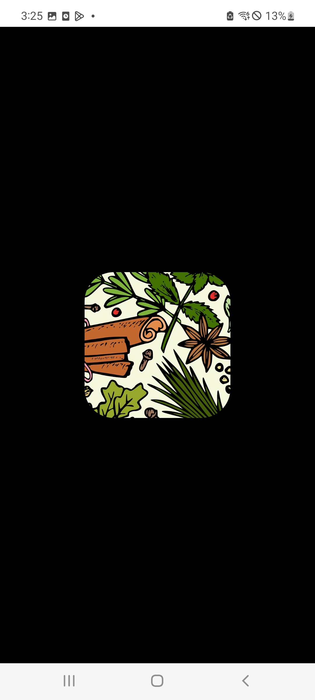

# DrawingMaskView

[](https://jitpack.io/#dantariun/DrawingMaskView)


|            circle            |         rect          |         rect_round          |
|:----------------------------:|:---------------------:|:---------------------------:|
|  |  |  |


### Gradle

```gradle
allprojects {
  repositories {
    ...
    maven { url 'https://jitpack.io' }
  }
}

 dependencies {
    implementation 'com.github.dantariun:DrawingMaskView:x.x.x'
 }
```

### How to use

```xml
<com.pepperkim.drawingmaskview.DrawingMaskView
        android:id="@+id/maskView"
        app:shape_type="circle"
        app:align="center"
        app:shadow_mode="destination_out"
        app:shadow_color="@color/black"
        app:radius_size="100"
        app:shape_width="100"
        app:shape_height="100"
        app:rect_round="100"
        android:layout_width="match_parent"
        android:layout_height="match_parent"/>
```
<br>

``` kotlin
    val mask:DrawingMaskView = findViewById(R.id.maskView)
    mask.changeCircleRadius(100) // px
    mask.changeShapeType(DrawingMaskView.Shapes.circle.data) // int
```
<br>
- Property

|type 	| data type | value | description	|
|---	|---		|---	|---			|
|shape_type|dimension|circle, rect, rect_round|default:circle|
| align | dimension | center, top, bottom, left, right, top_left, top_right, bottom_left, bottom_right | default : center |
| shasow_mode | dimension | clear, dst_in, dst_out | defalut : dst_out|
|shadow_color| int | shadow color | default : Color.BLACK |
|radius_size| int | circle radius size | default : 100 |
|shape_width| int | rect width size | default : 100 |
|shape_height| int | rect height size | default : 100 |
|rect_round| int | rect corners  | default : 10 |

- Method

| function                                       |
|------------------------------------------------|
| **changeAlign**(align:Aligns.item.data)                  |
| **changeShapeType**(type:Shapes.item.data)     |
| **changePorterDuffXfermode**(mode:ShadowModes.item.data) |
| **changeShadowColor**(color:Int)               |
| **changeCircleRadius**(radius:Int)             |
| **changeShapeWidth**(width:Int)                |
| **changeShapeHeight**(height:Int)              |
| **changeRectRound**(round:Int)                 |

