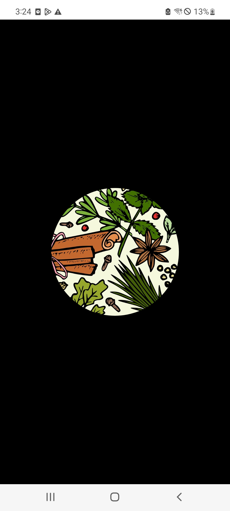

# DrawingMaskView

[](https://jitpack.io/#dantariun/DrawingMaskView)


|            circle            |         rect          |         rect_round          |
|:----------------------------:|:---------------------:|:---------------------------:|
|  |  |  |


### Gradle

```gradle
 repositories {
    maven { url "https://jitpack.io" }
 }

 dependencies {
    implementation 'com.github.dantariun:DrawingMaskView:1.0'
 }
```

### How to use

```xml
<com.pepperkim.drawingmaskview.DrawingMaskView
        android:id="@+id/maskView"
        app:shape_type="circle"
        app:align="center"
        app:shadow_mode="destination_out"
        app:shadow_color="@color/black"
        app:radius_size="100"
        app:shape_width="100"
        app:shape_height="100"
        app:rect_round="100"
        android:layout_width="match_parent"
        android:layout_height="match_parent"/>
```

- Property

|type 	| data type | value | description	|
|---	|---		|---	|---			|
|shape_type|dimension|circle, rect, rect_round|default:circle|
| align | dimension | center, top, bottom, left, right, top_left, top_right, bottom_left, bottom_right | default : center |
| shasow_mode | dimension | clear, source, source_over, source_in, source_out, destination, destination_over, destination_in, destination_out | defalut : destination_out|
|shadow_color| int | shadow color | default : Color.BLACK |
|radius_size| int | circle radius size | default : 100 |
|shape_width| int | rect width size | default : 100 |
|shape_height| int | rect height size | default : 100 |
|rect_round| int | rect corners  | default : 10 |

- Method

|function |
|---|
|**changeAlign**(align:Aligns)|
|**changeShapeType**(type:Shapes)|
|**changePorterDuffXfermode**(mode:ShadowModes)|
|**changeShadowColor**(color:Int)|
|**changeCircleRadius**(radius:Int)|
|**changeShapeWidth**(width:Int)|
|**changeShapeHeight**(height:Int)|
|**changeRectRound**(round:Int)|

